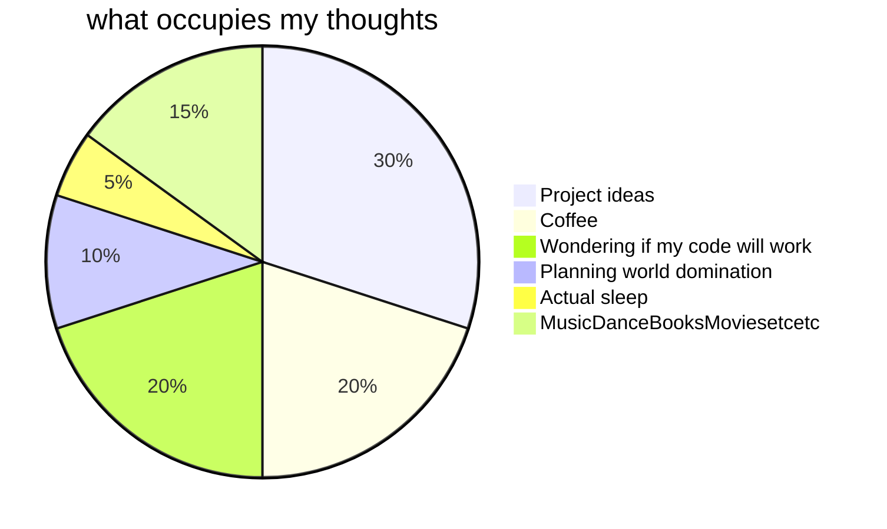
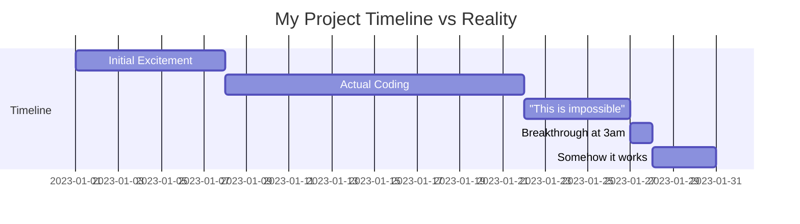

# Heyy thereee! ✨

## so like, an about me?
building things with heart, juggling a dozen ideas at once, and somehow making it all work.
trying to find my niche in tech, so i’m building, learning, and doing a little bit of everything.
i care about sustainability, relatability, and building with empathy—tech that actually helps, not just impresses.
it’s a bit chaotic, but it’s all heart.

currently split between:
- building random projects at 2am (productivity peaks at ungodly hours)
- learning React properly, not just vibe coding and hoping it works
- convincing people to join my chaotic but somehow functional project teams
- attempting to maintain a sleep schedule (failing spectacularly)

## my brain, visualized:

## stuff i've built when inspiration struck:
- Boba → made this because proximity based chatting made sense at the time
- Spill the tea → started at a hackathon, we gotta edit that more, but the UI for that is litttt!!!
- Lifelist → it's a work in progress don't @ me

## me vs. projects:

## tech i use when the chaos demands it:

  

## github stats because numbers are cool (ig)

  
  

## current status:
- [x] caffeinated
- [ ] knows what day it is
- [x] has too many browser tabs open
- [ ] actually finished documenting code(not really)

wanna collaborate? cool, message me!
